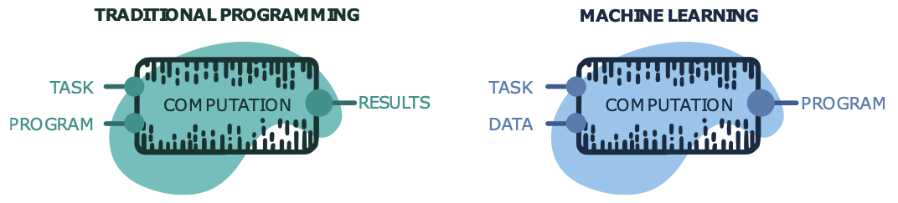
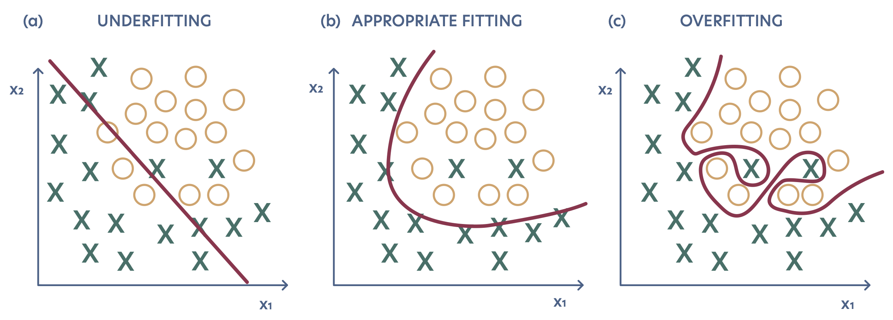

# Introduction to Machine Learning
Borja Requena

- [1 What is machine
  learning?](#what-is-machine-learning)
- [2 Machine learning
  tasks](#machine-learning-tasks)
- [3 Types of
  learning](#types-of-learning)
  - [3.1 Supervised
    learning](#supervised-learning)
  - [3.2 Unsupervised
    learning](#unsupervised-learning)
  - [3.3 Reinforcement
    learning](#reinforcement-learning)
- [4 Learning as an optimization
  task](#learning-as-an-optimization-task)
- [5 Capacity, overfitting and
  underfitting](#capacity-overfitting-and-underfitting)

<!-- WARNING: THIS FILE WAS AUTOGENERATED! DO NOT EDIT! -->

> **Note**
>
> This introduction has been adapted from Borja’s bibliography:
> references.bib PhD thesis \[@requena2024\].

# What is machine learning?

With the progress of technology, we encounter increasingly more complex
and abstract problems that are hard to formalize mathematically. For
instance, the problem of face recognition in images cannot be easily
presented in a formal mathematical way, or tasks such as detecting new
phases of matter may not even have a known mathematical formulation.
Hence, these types of problems cannot be effectively addressed using
standard hard-coded algorithms.

The field of machine learning (ML) emerges as a new paradigm to develop
algorithms that are not explicitly programmed, but learned from
experience instead, typically in the form of data.
<a href="#fig-programming_vs_ml" class="quarto-xref">Figure 1</a>
provides a visual comparison between traditional programming and ML. In
traditional programming, an input task and a program to solve it yield
the desired result after some computation. In ML, an input task and
related data instances result in a program to solve the task. For
example, the data can be pairs of problem examples and their solutions.

This process heavily relies on applied statistics, emphasizing the use
of computers to approximate complex functions. Deep learning
\[@goodfellow:2016\], a subfield of ML, is the maximum exponent of this
trend. It employs parametrized hierarchical models to extract intricate
patterns from data, achieving outstanding results across various tasks.

In short, an ML algorithm is an algorithm capable of learning from data.
**We can consider a computer program to learn from experience with
respect to some class of tasks and performance measure if its
performance in those tasks improves with experience**
\[@Mitchell1997McGrawHill\]. Hence, there are a few fundamental
ingredients to any learning algorithm:

- **A task to solve**: Tasks are often defined in terms of how examples
  or data instances should be processed. These are usually represented
  by vectors **x** ∈ ℝ*n* where every entry is a *feature*.
  We show some typical ML tasks in the [applications
  chapter](https://borjarequena.github.io/Neural-Network-Course/course/applications-index.html).
- **A performance measure**: A consistent quantitative measure of the ML
  algorithm’s performance on the task. These metrics can range from
  simple direct comparisons between the obtained and expected output, to
  more involved and task-specific functions.
- **Data (experience)**: A data set containing a collection of data
  instances, potentially including the desired output **y** for each of
  them {(**x***i*, **y***i*)}. We consider
  different types of learning depending on the kind of data set the
  algorithm is allowed to experience, as detailed in the [types of
  learning section](#types-of-learning) below.
- **A model**: The structure that encodes the resulting program. This
  can range from a parametrized linear function, to a combination of
  deep neural networks.

In these terms, the learning process can be described as the iterative
maximization of the model’s performance on the given task and data.

# Machine learning tasks

The main ingredient in the learning process is a task. It is important
to distinguish the objective task with the learning process itself. The
latter is the process through which the ability to develop the task is
acquired. For example, if we would like a robot to walk, walking is the
task \[@goodfellow:2016\].

There are very diverse tasks that can be solved with ML. The most common
ones are regression and classification tasks. In regression tasks, we
typically assume a relationship between two variables of the form
**y** = *f*(**x**). In general, the two variables can be
multi-dimensional, and the objective is to find the function *f* that
relates them. In classification tasks, the objective is to learn a
function *f* that assigns an input **x** to a certain category or label
*y* among a finite set of labels. Unlike in regression tasks, these
categories do not need to have a numerical meaning and we typically
assign them an integer index to encode them.

We show some examples in the [machine learning application overview
section](https://borjarequena.github.io/Neural-Network-Course/course/applications-index.html),
and cover even more throughout the entire course!

# Types of learning

A crucial factor in the learning process is data, and its accessibility
often determines the types of learning we can consider. The notions of
task and data are intertwined: certain tasks can only be solved if
sufficient data is available, and richer data enables the seamless
transition between tasks. In the ML field, we typically refer to data in
terms of a data set 𝒟, containing a finite amount of data instances
often called *data points* or *examples* **x***i*. The data
set may exclusively contain the data instances,
𝒟 = {**x***i*}, or they may also be accompanied by predefined
labels or targets **y***i*, forming tuples
𝒟 = {(**x***i*, **y***i*)}. In some cases, the
data points can be organized into a *design matrix* **X**, formed by
stacking {**x***i*} either row- or column-wise.

Each element of every data point **x***i* is known as a
*feature*, and it is a descriptor of a specific aspect of the example.
Selecting the right features to characterize the object of interest can
be challenging: too few might fail to capture all relevant aspects,
whereas too many can lead to spurious correlations that interfere with
the conclusions drawn from the data. Additionally, the data can be
arbitrarily processed and transformed, for instance, subtracting the
mean of every feature across the data set 𝒟 from each data point prior
to any further analysis. Determining the right data representation is a
central problem in ML, as it is essential to perform any task, and it is
the core of the field of representation learning.

In general, the type of available data effectively defines the types of
learning our model can be faced with. These are usually divided into
three categories: supervised, unsupervised, and reinforcement learning.

## Supervised learning

Supervised learning refers to ML algorithms that learn from *labeled*
data 𝒟 = {(**x***i*, **y***i*)}. There exist
various approaches to supervised learning, spanning from statistical
methods to classical ML and deep learning. In most cases, substantial
amounts of data are required for the training process, which entails the
accurate labeling of the data. This is usually considered one of the
most significant drawbacks of supervised learning, as obtaining
perfectly matched labels is not always feasible or may require extensive
manual annotation by humans.

## Unsupervised learning

While labeled data may be scarce, we often have access to large amounts
of raw unlabeled data 𝒟 = {**x***i*}. In this case, we can
employ unsupervised learning, which refers to ML algorithms that learn
from *unlabeled* data. Unsupervised learning can either be used for
preliminary pre-processing steps, such as dimensionality reduction, or
for representation learning, as in data clustering. Furthermore, it can
be used to learn the underlying probability distribution of the data and
generate entirely new examples.

## Reinforcement learning

In contrast to the two previous types of learning, some ML do not rely
on a fixed data set 𝒟. For instance, in *reinforcement learning*, we
usually do not even have a data set at all from the beginning. Instead,
the learning algorithm interacts with an *environment* in a feedback
loop to accomplish a given task. The data set is gradually shaped as the
learning system collects experiences derived from these interactions.
Different reinforcement learning algorithms manage the collected data
differently, although it is always leveraged to achieve the objective
task.

# Learning as an optimization task

The model encodes the structure of the resulting program, and it is
typically a function of the data, *f*(**x**), whose output depends on
the task. For example, the output can be a class from a discrete set of
possible classes in a classification task, or a complex-valued tensor in
a regression task. Finding the function that provides the best mapping
between the data and the desired outcome for a specific task is at the
heart of ML. The model is usually characterized by a set of parameters
**θ**, and all its possible parametrizations form the set of functions
known as the *hypothesis space*.

The performance measure objectively quantifies the model’s performance
in a given task. For example, in a classification task, we may consider
the *accuracy*, which is the proportion of examples for which the model
outputs the correct result. We can obtain the same information with the
*error rate*, which is the proportion of missclassified examples. In a
regression task, we may consider the squared difference between the
model’s output and the desired value averaged over all data points,
known as the mean squared error (MSE).

We distinguish between *metrics* and *loss functions*. The former are
performance measures that provide valuable information but may not be
smooth, such as the accuracy. Conversely, the latter may not be as
informative, but they are always differentiable. Typically, loss
functions quantify the errors performed by the model such that smaller
losses translate into better models.

For example, in a regression task we may consider the the MSE as loss
function, which is defined as: where *n* is the size of the data set and
*y**i* is the expected value for each sample
**x***i*. For a classificationt task, we may use the
cross-entropy loss function: In these cases, *f*(**x***i*) is
a vector containing the probability that the data point
**x***i* belongs to each of the possible classes, and
**y***i* is the vector of the true class, e.g.,
**y***i* = \[0, 0, 1, 0\]*T* encodes the third
class in a four-class classification problem. The absolute value of
ℒCE does not provide a clear idea of the model’s performance,
unlike the accuracy, but it is a smooth function in its domain.

**Machines \`\`learn’’ by minimizing the loss function ℒ, over the
training data set**, i.e., the data available during the learning
process. Formally, the objective is to find the optimal model parameters
**θ**\* in the hypothesis space that minimize ℒ. The
minimization is usually performed by gradient-based techniques, hence
the emphasis on the differentiability of ℒ. Therefore, learning becomes
an optimization process.

# Capacity, overfitting and underfitting

The central challenge in ML is to ensure the model can *generalize*
well. This means the resulting model should perform effectively on new
data, never seen during the learning process. While learning, also known
as training, our algorithm has access to the training data, as briefly
introduced in the previous section. This allows us to quantify the
performance over the so-called training set, obtaining a training error.
To assess the generalization capabilities of the model, we hold out some
data from the training process, forming a *test set*, and measuring the
performance on this previously unseen data. This provides a test or
generalization error. **What distinguishes ML from mere function fitting
is that the goal in ML is to keep both the training and test errors low,
ensuring the proper generalization of the model.**

Given that the parameter optimization of our model is performed in the
training set, the expected test error is higher or equal than the
expected training error. Their difference is known as the
*generalization gap*, and it persists even when the training and test
data are generated by identical probability distributions. Indeed, it
may only disappear in the limit of infinite data. Hence, the overall
performance of an ML model can be evaluated considering two factors: the
training error and the generalization gap, which should both be as small
as possible.

These two factors are related to two main challenges of ML: overfitting
and underfitting. In short, underfitting occurs whenever the training
error is not low enough, meaning that the model is unable to
successfully develop the task. Overfitting is characterized by a large
generalization gap, which is often the result of a low training error
combined with a high test error. In these cases, the generalization is
hindered by the model learning the specific details of the training
data, rather than capturing the main patterns.
<a href="#fig-under_overfitting" class="quarto-xref">Figure 2</a> shows
a schematic depiction of both phenomena.

The tendency of the model to under- or overfit can be tuned by changing
the model’s *capacity*. The capacity can be loosely understood as the
measure of a model’s ability to fit a wide variety of functions
\[@goodfellow:2016\]. Models with low capacity may be unable to fit the
training set, resulting in underfitting. On the other hand, models with
a capacity much higher than required for the task tend to overfit,
typically adjusting to the particularities of the training set, which
may not be true for the general distribution. The challenge is to find
the capacity that is \`\`just right’’ for the task.

To address this challenge, the data set can be further split to include
a *validation set*, resulting in three subsets: training, validation and
test sets. The validation set serves as pseudo-test set to evaluate the
model’s generalization capabilities and adjust its *hyper-parameters*,
which may impact its capacity. For example, the capacity can be
controlled by constraining the model’s hypothesis space. In the case of
a linear regression model, the hypothesis space contains all linear
functions. Generalizing the linear model to include polynomial functions
up to the *k*-th degree effectively increases its capacity, as shown in
the [linear models
section](https://borjarequena.github.io/Neural-Network-Course/course/polynomial_fit.html).
Adjusting the maximum polynomial degree allows the fine-tuning of the
model’s capacity. In a deep learning architectures, the capacity can be
adjusted by tuning the number of neurons and their connections.

Hence, **the model learns from the data in the training set, and its
hyper-parameters are tuned based on the generalization gap between the
training and validation sets**. This process may involve multiple
training iterations as the model is being adjusted. Finally, **the
model’s performance is evaluated in the test, providing a real measure
of its performance on unseen data**.
